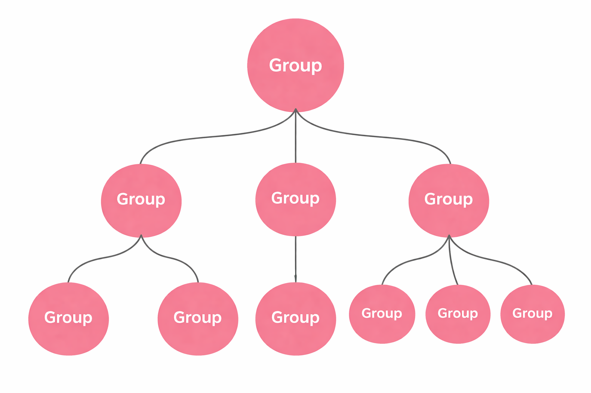

<h1 align="center">Computação Gráfica - 2ª Fase</h1>
 
### Hélder Miguel Cunha Alves - a104609
### Diogo Luı́s Barros Costa - a100751
### Rui Mário da Silva Costa - a107316

## 1. Representação das transformações

&nbsp;&nbsp;&nbsp;&nbsp;Representamos em memória as transformações de cada grupo acumulando-as numa única matriz, o que nos permite, no momento de renderização, aplicá-las simultaneamente.

## 2. Atualização do estado interno da aplicação engine

&nbsp;&nbsp;&nbsp;&nbsp;De maneira a acomodar a informação adicionada ao ficheiro de configuração, atualizamos a nossa aplicação para tratar cada grupo como um objeto individual.
&nbsp;&nbsp;&nbsp;&nbsp;Um objeto Grupo é constituído pelos os seguintes parâmetros:
- Uma matriz 4x4 que representa as suas transformações (translação, rotação e escala);
- Um vetor com os modelos;
- Um vetor de apontadores para Grupos filhos

&nbsp;&nbsp;&nbsp;&nbsp;Desta estrutura resulta uma *Rose Tree* que facilita o *bubble down* da aplicação das transformações.

<figure>
  
  <figcaption align="center">Figura 1: Representação da hierarquia de grupos <em>(imagem gerada com o auxílio de IA)</em> </figcaption>
</figure>

## 3. Renderização da cena

&nbsp;&nbsp;&nbsp;&nbsp;A renderização da cena é feita de maneira recursiva percorrendo a árvore de grupos usando um algoritmo *Depth-First*. A herança das transformações de pai para filhos é implementada tomando proveito da stack de matrizes do OpenGL: ao fazer push da matriz do pai, podemos lhe somar as transformações dos filhos e aplicá-la. Fazemos pop quando um grupo não tem filhos, o que restaura a matriz anterior. 

